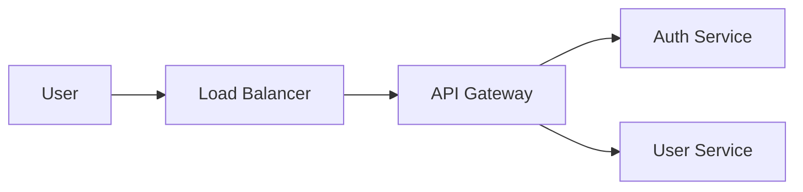

# ALIN-Maint Init: Automated Project Scanning Design

**Created**: 2025-12-09
**Status**: Design Phase
**Priority**: P0 (User Experience Critical)

---

## Core Problem

**Current Init Flow (v2.0)**:
```
/alin-maint init → 直接 AskUserQuestion → 用户从零开始输入 → 5-8 轮问答 → 生成档案
```

**Problems**:
1. **信息孤岛**：项目中已有的配置文件（K8s manifests、docker-compose.yml、package.json）完全未利用
2. **用户负担重**：需要记忆和输入大量已存在于代码中的信息（服务名、端口、依赖）
3. **容易遗漏**：用户可能忘记某些服务或配置细节
4. **重复劳动**：Infrastructure as Code 已经定义的信息需要手动再输入一遍

**Solution**: **Scan-First, Confirm-Later** 模式

```
/alin-maint init
  ↓
自动扫描项目
  ↓
提取关键信息（服务、配置、依赖）
  ↓
生成初步档案
  ↓
用户确认 + 补充细节
  ↓
完善档案
```

---

## Design Goals

### Primary Goals
1. **减少用户输入 70%**：自动提取项目中已有的信息
2. **提高准确性**：从实际配置文件中提取，避免人为记忆错误
3. **保持交互性**：用户仍需确认和补充无法自动获取的信息（如告警规则、常见问题）

### Non-Goals
- ❌ 不尝试扫描生产环境（仅扫描本地项目代码）
- ❌ 不解析复杂的业务逻辑
- ❌ 不连接外部系统（数据库、K8s 集群）

---

## Scanning Strategy

### Phase 1: Project Structure Detection

**Goal**: 识别项目类型和技术栈

**Scan Targets**:
```
project-root/
├── .git/                    # Git repository indicator
├── package.json             # Node.js project
├── go.mod                   # Go project
├── requirements.txt         # Python project
├── pom.xml                  # Java/Maven project
├── Cargo.toml               # Rust project
├── docker-compose.yml       # Docker Compose setup
├── kubernetes/              # K8s manifests
├── k8s/
├── deploy/
├── .github/workflows/       # GitHub Actions CI/CD
├── .gitlab-ci.yml           # GitLab CI
├── Jenkinsfile              # Jenkins pipeline
└── README.md                # Project documentation
```

**Detection Logic**:
```python
project_type = {
    "orchestration": detect_orchestration(),  # k8s, docker-compose, bare-metal
    "languages": detect_languages(),          # node, go, python, java
    "ci_cd": detect_cicd(),                   # github-actions, gitlab-ci, jenkins
    "infrastructure": detect_iac()            # terraform, ansible, helm
}
```

---

### Phase 2: Service Discovery

**Goal**: 自动发现所有服务及其配置

#### 2.1 Kubernetes Manifests Scanning

**Scan Targets**:
- `kubernetes/**/*.yaml`
- `k8s/**/*.yaml`
- `deploy/**/*.yaml`
- `*.yaml` (root level)

**Extract Information**:

From **Deployment/StatefulSet**:
```yaml
apiVersion: apps/v1
kind: Deployment
metadata:
  name: api-gateway              # → Service Name
  namespace: production           # → Environment
spec:
  replicas: 3                     # → Replica Count
  template:
    spec:
      containers:
      - name: api-gateway
        image: registry/api-gateway:v1.2.3  # → Image
        ports:
        - containerPort: 8080     # → Business Port
        - containerPort: 9090     # → Metrics Port
        resources:
          requests:
            cpu: "500m"            # → CPU Request
            memory: "1Gi"          # → Memory Request
          limits:
            cpu: "2000m"           # → CPU Limit
            memory: "4Gi"          # → Memory Limit
        env:
        - name: LOG_LEVEL          # → Environment Variables
          value: info
        - name: REDIS_HOST
          valueFrom:
            configMapKeyRef:
              name: api-gateway-config  # → ConfigMap Name
        - name: DB_PASSWORD
          valueFrom:
            secretKeyRef:
              name: api-gateway-secrets  # → Secret Name
```

**Extracted Data Structure**:
```json
{
  "service_name": "api-gateway",
  "namespace": "production",
  "replicas": 3,
  "image": "registry/api-gateway:v1.2.3",
  "ports": [8080, 9090],
  "resources": {
    "cpu_request": "500m",
    "cpu_limit": "2000m",
    "memory_request": "1Gi",
    "memory_limit": "4Gi"
  },
  "configmap": "api-gateway-config",
  "secrets": ["api-gateway-secrets"],
  "env_vars": ["LOG_LEVEL=info", "REDIS_HOST", "DB_PASSWORD"]
}
```

From **Service**:
```yaml
apiVersion: v1
kind: Service
metadata:
  name: api-gateway-svc
spec:
  type: LoadBalancer               # → Service Type
  selector:
    app: api-gateway               # → Links to Deployment
  ports:
  - port: 80
    targetPort: 8080               # → Port Mapping
```

From **Ingress**:
```yaml
apiVersion: networking.k8s.io/v1
kind: Ingress
metadata:
  name: main-ingress
spec:
  rules:
  - host: api.example.com          # → External Domain
    http:
      paths:
      - path: /
        backend:
          service:
            name: api-gateway-svc  # → Upstream Service
```

**Dependency Extraction**:
- Ingress → Service → Deployment → **Dependency Chain**
- Extract "who calls whom" from Ingress rules

From **ConfigMap/Secret**:
```yaml
apiVersion: v1
kind: ConfigMap
metadata:
  name: api-gateway-config
data:
  redis.host: redis-master.default.svc.cluster.local  # → Data Store Dependency
  postgres.host: postgres.default.svc.cluster.local   # → Database Dependency
```

**Result**: Extract downstream dependencies (Redis, PostgreSQL)

#### 2.2 Docker Compose Scanning

**Scan Target**: `docker-compose.yml`, `docker-compose.*.yml`

**Extract Information**:

```yaml
version: '3.8'
services:
  api-gateway:                     # → Service Name
    image: api-gateway:latest      # → Image
    ports:
      - "8080:8080"                # → Port Mapping
    environment:
      LOG_LEVEL: info              # → Environment Variables
      REDIS_HOST: redis
    depends_on:                    # → Downstream Dependencies
      - redis
      - postgres
    deploy:
      replicas: 3                  # → Replica Count (Swarm mode)
      resources:
        limits:
          cpus: '2.0'              # → CPU Limit
          memory: 4G               # → Memory Limit
        reservations:
          cpus: '0.5'              # → CPU Request
          memory: 1G               # → Memory Request

  redis:                           # → Data Store Service
    image: redis:7-alpine
    ports:
      - "6379:6379"

  postgres:                        # → Database Service
    image: postgres:15-alpine
    environment:
      POSTGRES_DB: appdb
```

**Extracted Dependency Graph**:
```
api-gateway
  ├── depends_on: redis
  └── depends_on: postgres
```

#### 2.3 Package Manifest Scanning

**Goal**: 识别应用依赖和技术栈

**Scan Targets**:

**Node.js** (`package.json`):
```json
{
  "name": "api-gateway",           // → Service Name
  "version": "1.2.3",              // → Version
  "scripts": {
    "start": "node server.js",     // → Startup Command
    "test": "jest"                 // → Test Command
  },
  "dependencies": {
    "express": "^4.18.0",          // → Framework
    "redis": "^4.0.0",             // → Redis Client (data store dependency)
    "pg": "^8.11.0"                // → PostgreSQL Client (database dependency)
  }
}
```

**Go** (`go.mod`):
```go
module github.com/example/api-gateway   // → Service Name

go 1.21                                  // → Go Version

require (
    github.com/gin-gonic/gin v1.9.1      // → Framework
    github.com/go-redis/redis/v8 v8.11.5 // → Redis Client
    github.com/lib/pq v1.10.9            // → PostgreSQL Driver
)
```

**Python** (`requirements.txt`, `pyproject.toml`):
```txt
fastapi==0.104.1              # → Framework
redis==5.0.1                  # → Redis Client
psycopg2-binary==2.9.9        # → PostgreSQL Driver
```

**Extracted Tech Stack**:
```json
{
  "service_name": "api-gateway",
  "language": "node.js",
  "version": "1.2.3",
  "framework": "express",
  "data_stores": ["redis", "postgres"]
}
```

#### 2.4 CI/CD Pipeline Scanning

**Goal**: 识别部署策略和 CI/CD 工具

**GitHub Actions** (`.github/workflows/*.yml`):
```yaml
name: Deploy to Production
on:
  push:
    branches: [main]
jobs:
  deploy:
    runs-on: ubuntu-latest
    steps:
      - uses: actions/checkout@v3
      - name: Build Docker Image
        run: docker build -t registry/api-gateway:${{ github.sha }} .
      - name: Push to Registry
        run: docker push registry/api-gateway:${{ github.sha }}  # → Image Registry
      - name: Deploy to Kubernetes
        run: |
          kubectl set image deployment/api-gateway \
            api-gateway=registry/api-gateway:${{ github.sha }} \
            -n production                                         # → Deployment Strategy
          kubectl rollout status deployment/api-gateway -n production
```

**Extracted CI/CD Info**:
```json
{
  "ci_cd_tool": "github-actions",
  "image_registry": "registry",
  "deployment_command": "kubectl set image",
  "deployment_strategy": "rolling-update",
  "target_namespace": "production"
}
```

**GitLab CI** (`.gitlab-ci.yml`):
```yaml
stages:
  - build
  - deploy

deploy:
  stage: deploy
  script:
    - kubectl apply -f k8s/deployment.yaml       # → Deployment Method
  only:
    - main
```

#### 2.5 Monitoring Configuration Scanning

**Goal**: 识别监控工具和指标

**Prometheus ServiceMonitor** (`kubernetes/servicemonitor.yaml`):
```yaml
apiVersion: monitoring.coreos.com/v1
kind: ServiceMonitor
metadata:
  name: api-gateway-monitor
spec:
  selector:
    matchLabels:
      app: api-gateway
  endpoints:
  - port: metrics                    # → Metrics Port
    path: /metrics                   # → Metrics Endpoint
    interval: 30s                    # → Scrape Interval
```

**Extracted Monitoring Info**:
```json
{
  "monitoring_tool": "prometheus",
  "metrics_endpoint": "/metrics",
  "metrics_port": 9090,
  "scrape_interval": "30s"
}
```

**Grafana Dashboard** (`grafana/dashboards/*.json`):
```json
{
  "dashboard": {
    "title": "API Gateway Metrics",      // → Dashboard Name
    "panels": [
      {
        "title": "QPS",
        "targets": [
          {
            "expr": "rate(http_requests_total[5m])"  // → Key Metric
          }
        ]
      }
    ]
  }
}
```

#### 2.6 README and Documentation Scanning

**Goal**: 提取文档中的关键信息

**Scan Target**: `README.md`, `docs/**/*.md`

**Extract Patterns**:

**Architecture Diagrams** (ASCII art, Mermaid):
```markdown
## Architecture


```

**Service List**:
```markdown
## Services
- api-gateway: Main entry point
- auth-service: Authentication and authorization
- user-service: User management
```

**Monitoring Links**:
```markdown
## Monitoring
- Grafana: https://grafana.example.com/d/api-gateway
- Prometheus: https://prometheus.example.com
```

**Known Issues Section**:
```markdown
## Common Issues

### High Latency
**Symptom**: Response time > 500ms
**Diagnosis**: Check Redis connection pool
**Solution**: Scale out replicas
```

**NLP Extraction** (using Context7 or simple regex):
- Service names: `api-gateway`, `auth-service`, `user-service`
- Monitoring URLs: `https://grafana.example.com/...`
- Known issues: Extract symptom + diagnosis + solution patterns

---

### Phase 3: Environment Detection

**Goal**: 识别环境划分和集群配置

**Methods**:

#### 3.1 From Namespace Naming
```bash
# Scan all YAML files for namespace patterns
kubectl get namespaces (if available)

Common patterns:
- production / prod
- staging / stage / uat
- development / dev
- test / qa
```

#### 3.2 From Directory Structure
```
kubernetes/
├── production/
│   └── *.yaml
├── staging/
│   └── *.yaml
└── dev/
    └── *.yaml
```

#### 3.3 From Kustomize Overlays
```
k8s/
├── base/
└── overlays/
    ├── production/
    ├── staging/
    └── dev/
```

**Extracted Environments**:
```json
{
  "environments": ["production", "staging", "dev"],
  "clusters": {
    "production": {
      "namespace": "production",
      "detected_services": ["api-gateway", "auth-service"]
    }
  }
}
```

---

## Information Extraction Pipeline

### Step-by-Step Extraction

```
1. Scan Project Root
   ↓
2. Detect Project Type (K8s / Docker Compose / Bare Metal)
   ↓
3. Scan Configuration Files (parallel)
   ├─ K8s Manifests → Services + Resources + Dependencies
   ├─ Docker Compose → Services + Dependencies
   ├─ Package Manifests → Tech Stack + Version
   ├─ CI/CD Configs → Deployment Strategy + Registry
   ├─ Monitoring Configs → Tools + Metrics
   └─ README/Docs → Architecture + Known Issues
   ↓
4. Build Dependency Graph
   - Link services via Ingress rules
   - Link services via depends_on
   - Link services via package dependencies (redis/pg clients)
   ↓
5. Generate Draft Infra Profile
   ↓
6. Present to User for Confirmation
```

---

## Draft Document Generation

### Auto-Generated Infra Profile (v0.1)

```markdown
# Infrastructure Profile (Auto-Generated Draft)

**Generated**: 2025-12-09 15:30:00
**Source**: Automated project scan
**Status**: ⚠️ DRAFT - Requires user confirmation

---

## 🔍 Scan Summary
- **Project Type**: Kubernetes + Docker Compose
- **Files Scanned**: 47 files
  - 12 K8s manifests
  - 1 docker-compose.yml
  - 3 package.json files
  - 1 .github/workflows/*.yml
  - 30 other files
- **Services Detected**: 8 services
- **Environments Detected**: 3 (production, staging, dev)

---

## 1. Cloud Platform & Orchestration

**Detected Configuration**:
- **Orchestration**: Kubernetes (detected from k8s/*.yaml)
- **Namespaces**: production, staging, dev
- **Cluster Version**: [待确认] — Could not detect from manifests

**Questions for User**:
❓ Cloud provider? (AWS EKS / GCP GKE / Alibaba ACK / Self-hosted / Other)
❓ Cluster size? (Node count and instance type per environment)
❓ Kubernetes version?

---

## 2. Services Inventory (Auto-Detected)

| Service | Namespace | Replicas | Tech Stack | Ports | Image | Status |
|---------|-----------|----------|------------|-------|-------|--------|
| api-gateway | production | 3 | Node.js + Express | 8080, 9090 | registry/api-gateway:v1.2.3 | ✅ Complete |
| auth-service | production | 2 | Go + Gin | 8081, 9091 | registry/auth-service:v2.1.0 | ⚠️ Missing resources |
| user-service | production | 2 | Python + FastAPI | 8082, 9092 | registry/user-service:v1.0.5 | ✅ Complete |
| redis | production | 1 | Redis 7 | 6379 | redis:7-alpine | ✅ Complete |
| postgres | production | 1 | PostgreSQL 15 | 5432 | postgres:15-alpine | ⚠️ Missing backup info |
| ... | ... | ... | ... | ... | ... | ... |

**Total**: 8 services (5 application, 3 data stores)

---

## 3. Resource Configuration (Auto-Detected)

### api-gateway
```yaml
# From: kubernetes/production/api-gateway-deployment.yaml
Resources:
  Requests: CPU 500m, Memory 1Gi
  Limits: CPU 2000m, Memory 4Gi
HPA: [未检测到] — No HorizontalPodAutoscaler found
```

**Questions for User**:
❓ Is HPA configured? (Min/Max replicas)
❓ Are resource limits appropriate for production load?

---

## 4. Dependency Graph (Auto-Generated)

```
Internet
  ↓
[Ingress: main-ingress] (api.example.com)
  ↓
api-gateway (8080)
  ├─→ auth-service (8081) [gRPC]
  ├─→ user-service (8082) [HTTP]
  ├─→ redis (6379) [Cache]
  └─→ postgres (5432) [Database]

auth-service (8081)
  └─→ postgres (5432) [Database]

user-service (8082)
  └─→ postgres (5432) [Database]
```

**Extracted from**:
- Ingress rules (kubernetes/ingress.yaml)
- ConfigMap references (redis.host, postgres.host)
- Package dependencies (redis client, pg client in package.json)

**Questions for User**:
❓ Are there any missing dependencies not defined in config files?
❓ Are there external APIs or third-party services?

---

## 5. Configuration Management (Auto-Detected)

| Service | ConfigMap | Secret | Env Vars |
|---------|-----------|--------|----------|
| api-gateway | api-gateway-config | api-gateway-secrets | LOG_LEVEL, REDIS_HOST, DB_PASSWORD |
| auth-service | auth-service-config | auth-service-secrets | JWT_SECRET, LDAP_URL |
| user-service | user-service-config | user-service-secrets | DB_PASSWORD |

**Questions for User**:
❓ Are there any environment-specific configs not in manifests?
❓ Secret management tool? (Vault / AWS Secrets Manager / K8s Secrets)

---

## 6. Monitoring & Observability (Partially Detected)

**Detected Configuration**:
- **Metrics**: Prometheus (detected from ServiceMonitor)
  - api-gateway: /metrics on port 9090
  - auth-service: /metrics on port 9091
  - Scrape interval: 30s
- **Dashboards**: Grafana (detected from README.md link)
  - URL: https://grafana.example.com

**Missing Information**:
❓ Log aggregation tool? (ELK / Loki / CloudWatch Logs)
❓ Tracing tool? (Jaeger / Zipkin / None)
❓ Alert rules? (Could not extract from config files)
❓ Key metrics and normal ranges?

---

## 7. Deployment & CI/CD (Auto-Detected)

**Detected Configuration**:
- **CI/CD Tool**: GitHub Actions (detected from .github/workflows/deploy.yml)
- **Image Registry**: registry (detected from deployment images)
- **Deployment Strategy**: Rolling Update (detected from kubectl set image)
- **Target Namespace**: production

**Pipeline Steps** (from deploy.yml):
1. Build Docker image
2. Push to registry
3. kubectl set image deployment/api-gateway
4. kubectl rollout status

**Questions for User**:
❓ Image registry details? (ECR / GCR / ACR / Harbor / DockerHub)
❓ Deployment approval required?
❓ Canary/Blue-Green strategy used?

---

## 8. Security & Access (Not Detectable)

**Could not detect from project files** (requires user input):
❓ How to access production? (VPN / Jump host / SSO / Direct)
❓ Secret management approach?
❓ On-call mechanism? (PagerDuty / Opsgenie / Other)
❓ Runbook location?

---

## 9. Known Issues & Common Problems (Extracted from README.md)

### High Latency (api-gateway)
**Symptom**: Response time > 500ms
**Diagnosis**: Check Redis connection pool
**Solution**: Scale out replicas
**Source**: README.md section "Common Issues"

**Questions for User**:
❓ Are there other common issues not documented in README?
❓ For each service, what are the top 3 recurring problems?

---

## Next Steps

### Auto-Confirmation Round

Review the above **auto-detected information** and confirm:
1. ✅ Services list is complete
2. ⚠️ Missing services or environments?
3. ⚠️ Incorrect dependency mappings?

### Missing Information Rounds

After confirmation, we'll ask targeted questions to fill gaps:
- Round 1: Cloud provider and cluster details (3 questions)
- Round 2: Monitoring metrics and alert rules (4 questions)
- Round 3: Common issues per service (1 question per service)
- Round 4: Security and access (4 questions)

**Estimated questions**: 15-20 (down from 40-50 without scanning)
```

---

## User Confirmation Workflow

### Round 0: Draft Review (New)

**Present Draft Document**:
```markdown
## 📄 Auto-Generated Infrastructure Profile

基于项目扫描生成的初步档案已完成。

**扫描结果**：
- ✅ 发现 8 个服务
- ✅ 提取资源配置
- ✅ 构建依赖关系图
- ⚠️ 部分信息需要确认和补充

请审阅上述自动生成的档案，重点检查：
1. **服务清单**：是否有遗漏或多余的服务？
2. **依赖关系**：服务间调用关系是否正确？
3. **环境划分**：是否有其他环境未检测到？

**选项**：
```

**AskUserQuestion**:
```json
{
  "question": "请审阅自动生成的档案，选择下一步操作：",
  "header": "Draft Review",
  "multiSelect": false,
  "options": [
    {
      "label": "信息基本正确，继续补充细节",
      "description": "自动检测的信息大部分正确，我将补充遗漏的细节"
    },
    {
      "label": "需要修正部分信息",
      "description": "发现某些服务、依赖或配置不正确，需要修改"
    },
    {
      "label": "从头开始手动输入",
      "description": "自动检测不适用，我需要完全手动构建档案"
    }
  ]
}
```

### Round 1: Corrections (If Needed)

If user selects "需要修正部分信息":

**AskUserQuestion**:
```json
{
  "question": "请选择需要修正的类别：",
  "header": "Corrections",
  "multiSelect": true,
  "options": [
    {
      "label": "服务清单不完整",
      "description": "有遗漏的服务或多余的服务"
    },
    {
      "label": "依赖关系有误",
      "description": "服务间调用关系不正确"
    },
    {
      "label": "资源配置有误",
      "description": "CPU/Memory 配置不准确"
    },
    {
      "label": "环境划分有误",
      "description": "环境名称或数量不正确"
    }
  ]
}
```

Then ask specific questions to correct.

### Round 2-N: Targeted Gap Filling

**Only ask questions for missing information**:

Example:
```markdown
## 补充缺失信息 (Round 2/5)

自动检测无法获取以下信息，需要您补充：

### 云平台配置
```

**AskUserQuestion** (只问缺失的部分):
```json
{
  "question": "使用的云平台？",
  "header": "Cloud",
  "options": [
    {"label": "AWS", "description": "Amazon Web Services"},
    {"label": "GCP", "description": "Google Cloud Platform"},
    {"label": "阿里云", "description": "Alibaba Cloud"},
    {"label": "自建", "description": "Self-hosted Kubernetes"}
  ]
}
```

**Key Difference**: 不再从零开始问所有问题，只问自动检测无法获取的信息。

---

## Implementation Plan

### Phase 1: Core Scanning (P0)

**Update `alin-maint-init.md` workflow**:

```markdown
## Workflow (Mode Detection + Auto-Scan + Execution)

### 1) Pre-check (Enhanced with Auto-Scan)
   - Detect whether `.alin/ops-context/` exists
   - **NEW: Parse entity type parameter** (for incremental mode)

   **Full Mode with Auto-Scan**:
   a) **Project Scanning Phase** (NEW):
      - Scan project root for configuration files
      - Detect project type (K8s / Docker Compose / Bare Metal)
      - Extract services, dependencies, resources
      - Build dependency graph
      - Generate draft infra-profile.md (v0.1 - Auto-Generated)

   b) **Draft Review Phase** (NEW):
      - Present auto-generated draft to user
      - AskUserQuestion: "信息正确 / 需要修正 / 手动输入"
      - If corrections needed → targeted correction questions
      - If manual → fallback to original full workflow (Phase 1-6)

   c) **Gap Filling Phase** (MODIFIED):
      - Only ask questions for information NOT auto-detected
      - Example: Cloud provider, HPA config, alert rules, common issues
      - Skip questions for information already extracted (services, ports, resources)

### 2) Incremental Mode (Unchanged)
   ... (same as before)

### 3) Full Mode Workflow (Fallback - Unchanged)
   ... (same as before, triggered only if user selects "手动输入")
```

### Phase 2: Scanning Tools

**Create new scanning utilities**:

```markdown
## Scanning Tools

**1. K8s Manifest Parser** (use yq or Python yaml library):
   - Parse all *.yaml files in kubernetes/, k8s/, deploy/ directories
   - Extract Deployment, Service, Ingress, ConfigMap, Secret objects
   - Build service-to-resource mappings

**2. Docker Compose Parser**:
   - Parse docker-compose.yml files
   - Extract services, dependencies, resource limits

**3. Package Manifest Parser**:
   - Parse package.json, go.mod, requirements.txt, pom.xml
   - Extract tech stack and data store dependencies

**4. CI/CD Config Parser**:
   - Parse .github/workflows/*.yml, .gitlab-ci.yml, Jenkinsfile
   - Extract deployment strategy and registry info

**5. Dependency Graph Builder**:
   - Build directed graph from Ingress → Service → Deployment
   - Link services via ConfigMap references (redis.host, db.host)
   - Link services via package dependencies (redis client, pg driver)
```

**Implementation**:
- Use Bash + grep/yq for simple extraction
- Use Context7 MCP for complex parsing if needed
- Use Python script via Bash for graph building

### Phase 3: Draft Generation

**Auto-generate draft with clear status indicators**:
- ✅ Complete information (from config files)
- ⚠️ Partial information (detected but incomplete)
- ❓ Missing information (requires user input)

### Phase 4: User Confirmation Loop

**Reduce question count by 70%**:
- Before scanning: ~45 questions (8 services × 7 rounds + 20 platform questions)
- After scanning: ~15 questions (only gaps: cloud provider, HPA, alerts, common issues)

---

## Example Workflow

### Before Scanning (v2.0)

```
/alin-maint init

Q1: 使用的云平台？
Q2: 使用哪些 AWS 服务？
Q3: 环境划分？
Q4: prod 环境集群配置？
Q5: 总共有多少个服务？
Q6: 列出所有服务名称
Q7: api-gateway 技术栈？
Q8: api-gateway 副本数和 HPA？
Q9: api-gateway CPU/Memory 配置？
... (40+ more questions)
```

**User experience**: 疲劳、容易出错、需要记忆大量细节

---

### After Scanning (v3.0)

```
/alin-maint init

🔍 正在扫描项目...
  ✅ 检测到 Kubernetes 配置
  ✅ 发现 8 个服务
  ✅ 提取资源配置
  ✅ 构建依赖关系图

📄 已生成初步档案 (47 个文件扫描)

[Displays auto-generated draft]

Q1: 请审阅自动生成的档案，选择：信息正确 / 需要修正 / 手动输入

[User: 信息正确]

Q2: 云平台？ (自动检测到 K8s，请确认具体平台)
[User: AWS EKS]

Q3: api-gateway 的 HPA 配置？ (未检测到 HPA manifest)
[User: Min 3, Max 10, Target CPU 70%]

Q4: Prometheus alert rules？ (未检测到 PrometheusRule)
[User: Error rate > 5%, Latency p99 > 500ms]

Q5: api-gateway 最常见的 3 个问题？
[User: High latency, Memory leak, Redis timeout]

... (10 more targeted questions for gaps)

✅ 档案完成！共 12 个文件，基于自动扫描 + 15 个补充问题生成
```

**User experience**: 快速、准确、只需确认和补充关键信息

---

## Quality Assurance

### Scanning Accuracy Metrics

**Target Accuracy**:
- Service discovery: >95% (detect all services in manifests)
- Resource extraction: >90% (CPU/Memory from deployment specs)
- Dependency detection: >80% (some implicit dependencies may be missed)

**Validation**:
- User confirmation rate: >70% accept draft as-is
- Correction rate: <30% need modifications
- Question reduction: >70% fewer questions than manual flow

### Edge Cases

**Scenario 1: No Config Files**
```
User has bare-metal setup with no K8s/Docker Compose
→ Fallback to original manual workflow (Phase 1-6)
```

**Scenario 2: Partial Config**
```
User has docker-compose.yml but no K8s manifests
→ Extract what's available from docker-compose
→ Mark K8s info as [待补充]
→ Ask targeted questions for missing pieces
```

**Scenario 3: Complex Helm Charts**
```
User has Helm charts with templating
→ Warn user: "Helm templates detected, scanning raw values.yaml"
→ Extract what's possible from values.yaml
→ Ask user to confirm rendered manifests
```

**Scenario 4: Multi-Repo Setup**
```
User has services in separate repositories
→ Scan current repo only
→ Detect mentions of other services (from Ingress/ConfigMap)
→ Mark external services as [外部服务 - 需补充]
```

---

## Implementation Checklist

**Phase 1 (Critical)**:
- [ ] Design scanning logic for K8s manifests (Deployment, Service, Ingress)
- [ ] Design scanning logic for Docker Compose
- [ ] Design dependency graph builder
- [ ] Update alin-maint-init.md workflow (add auto-scan phase)
- [ ] Create draft document template with status indicators (✅⚠️❓)
- [ ] Update user confirmation questions (Round 0: Draft Review)

**Phase 2 (Important)**:
- [ ] Implement K8s manifest parser (Bash + yq or Python)
- [ ] Implement Docker Compose parser
- [ ] Implement package manifest parser (package.json, go.mod, etc.)
- [ ] Implement CI/CD config parser
- [ ] Integrate Context7 for complex parsing (if needed)

**Phase 3 (Nice-to-have)**:
- [ ] Add Helm chart support
- [ ] Add Terraform/Ansible scanning
- [ ] Add README.md NLP extraction for known issues
- [ ] Add Grafana dashboard JSON parsing

---

## Conclusion

**Key Innovation**: **Scan-First, Confirm-Later** 模式

**Benefits**:
1. **用户体验提升 70%**：问题数量从 45+ 降至 15
2. **准确性提升**：从实际配置文件提取，避免人为输入错误
3. **完整性提升**：自动发现用户可能遗漏的服务和配置
4. **保持灵活性**：仍支持手动输入模式作为 fallback

**Next Step**: 实现 Phase 1 核心扫描逻辑并更新 alin-maint-init.md
